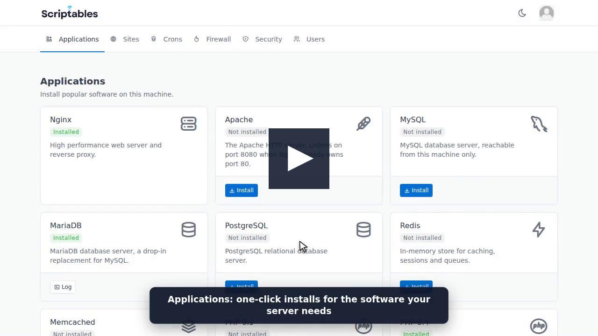

# Scriptables

Scriptables is an open-source control panel for Ubuntu servers. Install applications, deploy sites from GIT, manage your firewall and set up CRONs - all from a friendly web interface.

[](docs/demo.mp4)

Watch the [two minute demo](docs/demo.mp4) to see it install software, deploy a Laravel site and harden SSH.

## Features

 - **Applications** - one click installs for Nginx, Apache, MySQL, MariaDB, PostgreSQL, Redis, Memcached, PHP, Node.js, Docker, Certbot, Supervisor, Fail2ban and more.
 - **Sites** - deploy Laravel projects from GIT, with deploy keys, push webhooks and Let's Encrypt certificates.
 - **Crons** - schedule jobs from the browser.
 - **Firewall** - add and remove ufw rules from the browser.
 - **Security** - a checklist with green and red lights, and one form to harden SSH: custom port, no root login, key only access and a password protected sudo user.
 - **Logs** - every install, deploy, cron and firewall change keeps its full output.
 - **Users** - invite your team and protect accounts with two factor authentication.

## Requirements

 - A fresh Ubuntu server with systemd. Tested on Ubuntu 24.04.
 - Root or sudo access to run the installer.
 - Optional: a domain name pointing at the server if you want HTTPS.

## Install

```
curl -fsSL https://raw.githubusercontent.com/kevincoder-co-za/scriptables/refs/heads/main/autoprovision.sh | sudo bash
```

The installer finishes by printing a one time registration token. Open `http://your-server-ip:1323/users/register`, enter the token and create your admin account.

### Install with a domain and HTTPS

Point your domain at the server first, then run:

```
curl -fsSL https://raw.githubusercontent.com/kevincoder-co-za/scriptables/refs/heads/main/autoprovision.sh | sudo bash -s -- --domain panel.example.com --email you@example.com
```

Scriptables is then served on `https://panel.example.com`. Nginx terminates SSL and proxies to the service, which only listens on `127.0.0.1:1323`.

### Installer options

| Option | What it does |
| --- | --- |
| `--domain example.com` | Installs Certbot and sets up Nginx as an HTTPS reverse proxy for this domain. |
| `--email you@example.com` | Email address for Let's Encrypt expiry notices. Only used with `--domain`. |
| `--skip-firewall` | Leaves ufw untouched. |
| `--reset-registration-token` | Issues a new one time registration token. |

### What the installer does

 1. Creates a `scriptables` user with passwordless sudo.
 2. Places the app in `/opt/scriptables`.
 3. Installs Go and builds the binary for the machine.
 4. Adds a `scriptables` systemd service on port `1323`.
 5. Installs Nginx.
 6. Enables ufw and allows SSH, 80, 443 and 1323 (1323 stays closed when a domain is used).

The installer is safe to re-run. It updates the checkout, rebuilds the binary and restarts the service, keeping your data and secrets.

### Registration

The register page only exists while there are no users. It also asks for the registration token printed by the installer, so nobody else can claim a freshly installed or emptied server.

 - The token is shown once. Only its SHA-256 hash is stored, in `/etc/secrets/scriptables/registration_token`, readable by the `scriptables` user only.
 - The token is removed as soon as the first account is created. Further users are invited from the Users page.
 - Lost the token before registering? Re-run the installer with `--reset-registration-token` to get a new one.

## Running Scriptables

| Task | Command |
| --- | --- |
| View logs | `journalctl -u scriptables -f` |
| Restart | `sudo systemctl restart scriptables` |
| Stop | `sudo systemctl stop scriptables` |
| Update | Re-run the installer |

## Configuration

Settings live in `/opt/scriptables/.env`. Restart the service after changing them.

| Setting | Purpose |
| --- | --- |
| `SQLITE_PATH` | Where the SQLite database is stored. The installer uses `/opt/scriptables/data/scriptables.db`. |
| `SCRIPTABLES_SERVER_DSN_HOST` | Address the service listens on. |
| `SCRIPTABLES_SERVER_DSN_PORT` | Port the service listens on. Defaults to `1323`. |
| `SCRIPTABLE_URL` | Public URL, used in emails and deploy webhooks. |
| `ALLOWED_IPS` | Trusted reverse proxies, comma separated. |
| `ENCRYPTION_KEY` | Encrypts logs and passwords at rest. Must be 16, 24 or 32 characters. Do not change it once set. |
| `SESSION_SECRET` | Signs login sessions. Changing it logs everyone out. |
| `REGISTRATION_TOKEN_FILE` | Where the hashed registration token is stored. Defaults to `/etc/secrets/scriptables/registration_token`. |
| `SMTP_*` | Mail server used for invites and password resets. |
| `TZ` | Timezone, e.g. `Africa/Johannesburg`. |
| `VERBOSE_LOG` | Set to `yes` for more detailed service logs. |

Back up `/opt/scriptables/.env` and `/opt/scriptables/data` to keep everything you need to restore an install.

## Security

The Security page checks the server and shows a green or red light for each of these:

 - SSH moved off port 22.
 - Root login over SSH disabled.
 - SSH password login disabled.
 - A dedicated sudo user that needs a password for sudo.
 - Fail2ban protecting SSH.
 - Firewall enabled.

Fill in the SSH port, a username, a sudo password and your SSH public key, then apply. Scriptables creates the user, opens the new port in ufw, points Fail2ban at it and only then moves SSH and turns off root and password logins.

Keep your current SSH session open until you have logged in with `ssh -p <port> <username>@your-server`. If your hosting provider has its own firewall, open the new port there first.

The scripts live in `scriptables/security`. The sudo password is hashed before it is saved and removed once the settings are applied.

## Scriptables

Every install and deploy is a plain bash script, a "scriptable", found in the `scriptables` folder. Each application or site type has its own folder and its scripts run in alphabetical order.

```
scriptables/
  redis/install.sh
  laravel/001_update_known_hosts.sh
  laravel/002_fpm_setup.sh
  __shared/php_setup.sh
```

 - Scripts run as the `scriptables` user, use `sudo` for anything that needs root.
 - Add `# exit-on-failure=yes` to stop the run when that script fails.
 - `SCRIPTABLE::IMPORT php_setup` pulls in `scriptables/__shared/php_setup.sh`.
 - Placeholders such as `#DOMAIN#`, `#SITE_SLUG#` and `#PHP_VERSION#` are replaced before the script runs.

To add an application, create `scriptables/<name>/install.sh` and list it in the catalog in `models/Application.go`.

## Development

You only need Docker. The test VPS is an Ubuntu container with systemd that mounts this checkout and runs the app with [air](https://github.com/air-verse/air), so saving a Go file rebuilds and restarts it.

```
./testvps.sh
```

Then open `http://127.0.0.1:1323/users/register` and use the registration token printed by the script.

| Command | What it does |
| --- | --- |
| `./testvps.sh` | Creates or starts the test VPS. |
| `./testvps.sh reset-token` | Issues a new registration token. |
| `./testvps.sh logs` | Follows the app and air output. |
| `./testvps.sh shell` | Opens a root shell inside the VPS. |
| `./testvps.sh stop` | Stops the VPS, keeping its state. |
| `./testvps.sh destroy` | Removes the VPS. |

Nginx inside the VPS is reachable on `http://127.0.0.1:8081`. The test database and settings are kept in the `data` folder.

Installing applications, crons and firewall rules all change the machine they run on, so use the test VPS rather than your own machine.

## Known issues

 - Application installs target Ubuntu. PHP is installed from the ondrej PPA, which is Ubuntu only.
 - Only Laravel sites are supported today.

## Getting help

Please use the issue tracker to report bugs and new feature requests.